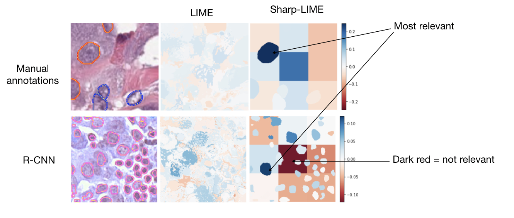

<!--
*** Thanks for checking out the Best-README-Template. If you have a suggestion
*** that would make this better, please fork the repo and create a pull request
*** or simply open an issue with the tag "enhancement".
*** Thanks again! Now go create something AMAZING! :D
***
***
***
*** To avoid retyping too much info. Do a search and replace for the following:
*** github_username, repo_name, twitter_handle, email, project_title, project_description
-->


<!-- PROJECT SHIELDS -->
<!--
*** I'm using markdown "reference style" links for readability.
*** Reference links are enclosed in brackets [ ] instead of parentheses ( ).
*** See the bottom of this document for the declaration of the reference variables
*** for contributors-url, forks-url, etc. This is an optional, concise syntax you may use.
*** https://www.markdownguide.org/basic-syntax/#reference-style-links
-->
[![Contributors][contributors-shield]][contributors-url]
[![Forks][forks-shield]][forks-url]
[![Stargazers][stars-shield]][stars-url]
[![Issues][issues-shield]][issues-url]
[![MIT License][license-shield]][license-url]
[![LinkedIn][linkedin-shield]][linkedin-url]


<!-- PROJECT LOGO -->
<br />
<p align="center">
  <a href="https://github.com/maragraziani/MICCAI2021_replicate">
    
  </a>

  <h3 align="center">Sharp-LIME: Sharpening Local Interpretable Model-agnostic Explanations for Histopathology</h3>

  <p align="center">
    Applying off-the-shelf methods with default configurations such as Local Interpretable Model-Agnostic Explanations (LIME) [1] is not sufficient to generate stable and understandable explanations in histopathology [3]. 
This work improves standard LIME by leveraging nuclei annotations, creating a reliable way for pathologists to audit black-box tumor classifiers.
The obtained visualizations reveal the sharp, neat and  high attention of the deep classifier to the neoplastic nuclei in the dataset, an observation in line with clinical decision making. Compared to standard LIME, our explanations show improved understandability for domain-experts, report higher stability and pass the sanity checks of consistency to data or initialization changes and sensitivity to network parameters. 
    <br />
    <a href="https://github.com/maragraziani/MICCAI2021_replicate"><strong>Explore the docs »</strong></a>
    <br />
    <br />
    <a href="https://github.com/maragraziani/MICCAI2021_replicate/notebooks">View Examples</a>
    ·
    <a href="https://github.com/maragraziani/MICCAI2021_replicate/issues">Report Bug</a>
    ·
  </p>
</p>


<!-- TABLE OF CONTENTS -->
<details open="open">
  <summary><h2 style="display: inline-block">Table of Contents</h2></summary>
  <ol>
    <li>
      <a href="#about-the-project">About The Project</a>
      <ul>
        <li><a href="#built-with">Based Upon</a></li>
      </ul>
    </li>
    <li>
      <a href="#getting-started">Getting Started</a>
      <ul>
        <li><a href="#prerequisites">Prerequisites</a></li>
      </ul>
    </li>
    <li><a href="#usage">Usage</a></li>
    <li><a href="#license">License</a></li>
    <li><a href="#contact">Contact</a></li>
    <li><a href="#acknowledgements">Acknowledgements</a></li>
  </ol>
</details>


<!-- ABOUT THE PROJECT -->
## About The Paper
We propose a methodology to improve the reliability and explainability of LIME for histopathology. Our main observation is that the unsupervised segmentation method used in standard LIME is not optimal to identify superpixels in pathology images.  
We improves tis approach by selecting regions in the image that have a semantic meaning, being either nuclei or portions of the background. 
This is obtained by exploiting the manual contours of nuclei in PanNuke breast images [4] and by using a Mask-RCNN to obtain segmentations of unlabelled nuclei in Camelyon [5]. To balance the foreground to background ratio, we divide the background tissue into nine blocks of small size and compare the LIME weights for these blocks against the nuclei. 

### Based Upon

* [1]() Ribeiro, Marco Tulio, Sameer Singh, and Carlos Guestrin. "" Why should i trust you?" Explaining the predictions of any classifier." Proceedings of the 22nd ACM SIGKDD international conference on knowledge discovery and data mining. 2016.
* [2]() Palatnik de Sousa, Iam, Marley Maria Bernardes Rebuzzi Vellasco, and Eduardo Costa da Silva. "Local interpretable model-agnostic explanations for classification of lymph node metastases." Sensors 19.13 (2019): 2969.
* [3]() Graziani, Mara, et al. "Evaluation and Comparison of CNN Visual Explanations for Histopathology." (2020).
* [4]() Gamper, Jevgenij, et al. "Pannuke: an open pan-cancer histology dataset for nuclei instance segmentation and classification." European Congress on Digital Pathology. Springer, Cham, 2019.
* [5]() Litjens, Geert, et al. "1399 H&E-stained sentinel lymph node sections of breast cancer patients: the CAMELYON dataset." GigaScience 7.6 (2018): giy065.

<!-- GETTING STARTED -->
## Getting Started

To get a local copy up and running follow these simple steps.

### Prerequisites

This code was developed in Python 3.6 and using Tensorflow 2. You will also need some standard packages to replicate the experiments.Follow the instructions in **Installation** to set the environment 

### Installation

1. Clone the repo
   ```sh
   git clone https://github.com/maragraziani/MICCAI2021_replicate
   ```
2. Install python packages with pip 
    ```sh
    pip install numpy pandas matplotlib h5py seaborn scikit-image 
    pip install git+https://github.com/palatos/lime@ColorExperiments
    ```

<!-- USAGE EXAMPLES -->
## Usage

Use this space to show useful examples of how a project can be used. Additional screenshots, code examples and demos work well in this space. You may also link to more resources.

For more examples, please refer to the [Notebooks](https://github.com/maragraziani/MICCAI2021_replicate/notebooks) folder

<!-- LICENSE -->
## License

Distributed under the MIT License. See `LICENSE` for more information.

<!-- CONTACT -->
## Contact

Mara Graziani - [@mormontre](https://twitter.com/mormontre) - mara.graziani@hevs.ch
Iam Palatnik - iam.palat@gmail.com

<!-- ACKNOWLEDGEMENTS -->
## Cite our work

If you make use of the code, please cite our paper in your work

```
@article{graziani2021sharpening,
title = "Sharpening Local Interpretable Model-agnostic Explanations for Histopathology: Improved Understandability and Reliability",
journal = "to be presented at MICCAI2021",
pages = "",
year = "2021",
issn = "",
doi = "",
author = "Mara Graziani and Iam Palatnik De Sousa and Marley M.B.R. Vellasco and Eduardo Costa da Silva and Henning Mueller and Vincent Andrearczyk"
}
```


<!-- MARKDOWN LINKS & IMAGES -->
<!-- https://www.markdownguide.org/basic-syntax/#reference-style-links -->
[contributors-shield]: https://img.shields.io/github/contributors/maragraziani/MICCAI2021_replicate.svg?style=for-the-badge
[contributors-url]: https://github.com/maragraziani/MICCAI2021_replicate/graphs/contributors
[forks-shield]: https://img.shields.io/github/forks/maragraziani/MICCAI2021_replicate.svg?style=for-the-badge
[forks-url]: https://github.com/maragraziani/MICCAI2021_replicate/network/members
[stars-shield]: https://img.shields.io/github/stars/maragraziani/MICCAI2021_replicate.svg?style=for-the-badge
[stars-url]: https://github.com/maragraziani/MICCAI2021_replicate/stargazers
[issues-shield]: https://img.shields.io/github/issues/maragraziani/MICCAI2021_replicate.svg?style=for-the-badge
[issues-url]: https://github.com/maragraziani/MICCAI2021_replicate/issues
[license-shield]: https://img.shields.io/github/license/maragraziani/MICCAI2021_replicate.svg?style=for-the-badge
[license-url]: https://github.com/maragraziani/MICCAI2021_replicate/blob/master/LICENSE.txt
[linkedin-shield]: https://img.shields.io/badge/-LinkedIn-black.svg?style=for-the-badge&logo=linkedin&colorB=555
[linkedin-url]: https://linkedin.com/in/mara-graziani-878980105/
